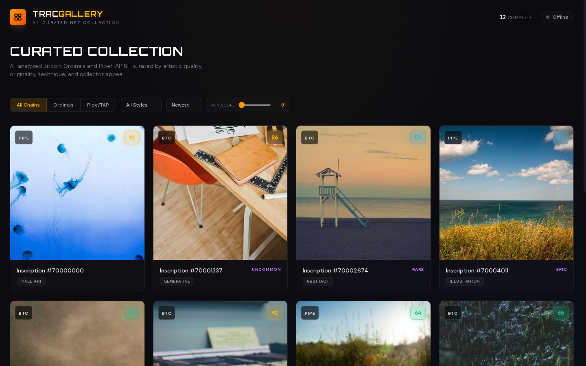
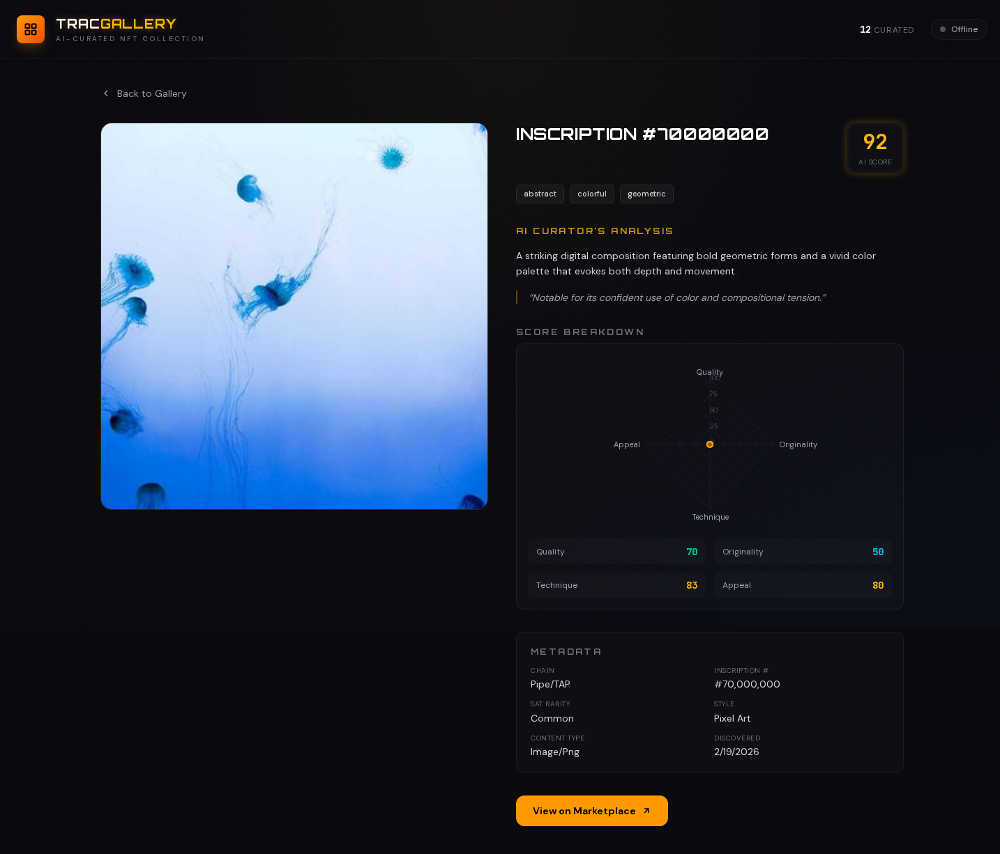

# TracGallery — AI-Curated NFT Gallery on Intercom

An **agent-first, AI-powered NFT gallery** built on the Trac Network Intercom P2P stack. TracGallery discovers Bitcoin Ordinals and Pipe/TAP NFTs, analyzes artwork with AI vision models, rates and curates collections, and broadcasts picks on P2P sidechannels — all without a central server.

**Trac Address:** `trac1w9s87vxc0nm6s36cg6g7a52f62ffy2zrwg6un6qvnl6dk7f0fwsqat7yvt`

> Fork of [Trac-Systems/intercom](https://github.com/Trac-Systems/intercom) for the Intercom Vibe Competition.

---

## Features

- **AI-Powered Curation** — Analyzes NFT artwork using Claude, OpenAI, OpenRouter, or local LLMs (Ollama). Rates on quality, originality, technique, and appeal.
- **Multi-Chain Discovery** — Bitcoin Ordinals via Hiro API + Pipe/TAP protocol NFTs.
- **Agent-First Architecture** — Runs as an Intercom peer. The AI agent IS the gallery.
- **Modern Dashboard** — Next.js web UI with dark theme, filterable grid, detail views, and radar charts.
- **P2P Social** — Curated picks broadcast on `0000tracgallery` sidechannel. No central server.
- **Multi-Provider AI** — Supports Anthropic, OpenAI, OpenRouter, and Ollama.

## Screenshots

**Gallery Grid View** — Browse AI-curated NFTs with score badges, chain indicators, and style tags:



**NFT Detail View** — AI analysis, radar chart score breakdown, metadata, and marketplace link:



## Quick Start

### Prerequisites
- Node.js >= 22.x (avoid v24.x)
- Pear runtime (`npm i -g pear`)
- An AI API key (Anthropic, OpenAI, OpenRouter, or Ollama running locally)

### Installation

```bash
# Clone this fork
git clone https://github.com/prismalaster/trac-gallery.git
cd trac-gallery

# Install Intercom dependencies
npm install

# Set up config
cp config.example.json config.json
# Edit config.json — add your AI API key and SC-Bridge token

# Install dashboard dependencies
cd dashboard && npm install && cd ..
```

### Running

**Terminal 1 — Start the Agent:**
```bash
pear run . --peer-store-name gallery1 \
  --sc-bridge 1 \
  --sc-bridge-token "your-secure-token" \
  --sc-bridge-cli 1
```

**Terminal 2 — Start the Dashboard:**
```bash
cd dashboard
NEXT_PUBLIC_SC_BRIDGE_TOKEN="your-secure-token" npm run dev
```

Open **http://localhost:3000** to view the gallery.

## Configuration

Edit `config.json` (copied from `config.example.json`):

| Field | Description | Default |
|-------|-------------|---------|
| `ai_provider` | AI provider: `anthropic`, `openai`, `openrouter`, `ollama` | `anthropic` |
| `anthropic_api_key` | Anthropic API key | — |
| `openai_api_key` | OpenAI API key | — |
| `openrouter_api_key` | OpenRouter API key | — |
| `ollama_base_url` | Ollama server URL | `http://localhost:11434` |
| `sc_bridge_token` | SC-Bridge auth token | — |
| `discovery_interval_ms` | How often to discover new NFTs (ms) | `900000` (15 min) |
| `discovery_batch_size` | NFTs per discovery cycle | `20` |
| `hiro_api_key` | Optional Hiro API key for higher rate limits | — |

## CLI Commands

| Command | Description |
|---------|-------------|
| `/tg_gallery [--limit N] [--chain ordinals\|pipe] [--min-score N]` | Browse curated NFTs |
| `/tg_trending [--limit N]` | Top-rated NFTs |
| `/tg_rate --id "<inscription_id>"` | Rate a specific NFT |
| `/tg_curate --theme "<theme>"` | Curate by theme |
| `/tg_status` | Gallery status and stats |

## Architecture

```
┌─────────────────────────────────────────────┐
│            Pear Runtime (Agent)              │
│                                             │
│  Sidechannel  ←→  SC-Bridge  ←→  Gallery   │
│  0000intercom     WebSocket      Feature    │
│  0000tracgallery  :49222         AI Curation│
└──────────────────────┬──────────────────────┘
                       │ WebSocket
┌──────────────────────┴──────────────────────┐
│          Next.js Dashboard (:3000)           │
│  NFT Grid  |  Detail View  |  Score Charts  │
└──────────────────────────────────────────────┘
```

## Upstream

Built on [Intercom](https://github.com/Trac-Systems/intercom) by Trac Systems.

For full agent-oriented instructions, see `SKILL.md`.

## Awesome Intercom

For a curated list of agentic Intercom apps: https://github.com/Trac-Systems/awesome-intercom

## License

See [LICENSE.md](LICENSE.md).
